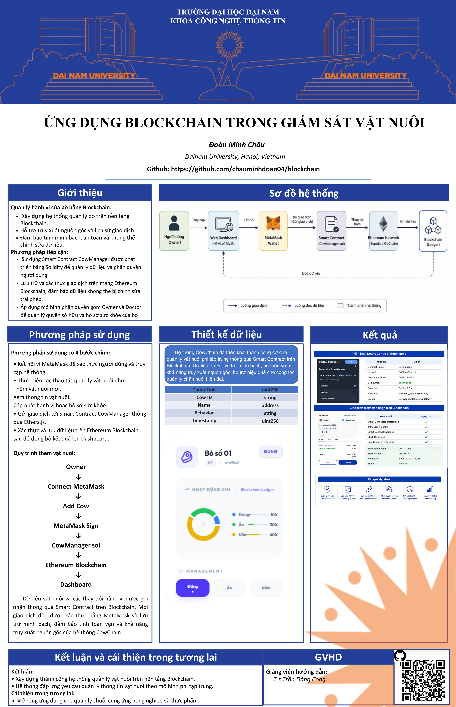
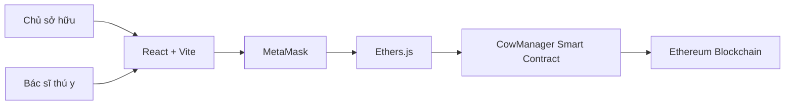

<div align="center">

<h1>HỆ THỐNG QUẢN LÝ VẬT NUÔI SỬ DỤNG BLOCKCHAIN</h1>

<h3>Ứng dụng công nghệ Blockchain trong quản lý thông tin vật nuôi</h3>



</div>

<br>

---

# MỤC LỤC

* Giới thiệu đề tài
* Bài toán đặt ra
* Mục tiêu hệ thống
* Kiến trúc hệ thống
* Chức năng chính
* Vai trò người dùng
* Công nghệ sử dụng
* Luồng hoạt động
* Hướng dẫn cài đặt
* Smart Contract
* Kết quả đạt được
* Hướng phát triển
* Thông tin thực hiện

---

# 1. GIỚI THIỆU ĐỀ TÀI

Trong lĩnh vực chăn nuôi hiện nay, việc quản lý thông tin vật nuôi chủ yếu được thực hiện bằng hồ sơ giấy hoặc các hệ thống cơ sở dữ liệu tập trung. Điều này dẫn đến nhiều hạn chế như:

* Khó kiểm tra nguồn gốc vật nuôi.
* Dễ xảy ra thất lạc dữ liệu.
* Khó theo dõi lịch sử thay đổi thông tin.
* Có nguy cơ chỉnh sửa hoặc giả mạo dữ liệu.
* Thiếu tính minh bạch trong quá trình quản lý.

Blockchain là công nghệ sổ cái phân tán cho phép lưu trữ dữ liệu theo cơ chế phi tập trung, đảm bảo tính minh bạch, toàn vẹn và không thể chỉnh sửa trái phép.

Đề tài **"Hệ thống quản lý vật nuôi sử dụng Blockchain"** được xây dựng nhằm ứng dụng Blockchain vào việc quản lý vật nuôi, giúp nâng cao hiệu quả quản lý và khả năng truy xuất dữ liệu trong lĩnh vực nông nghiệp và chăn nuôi.

---

# 2. BÀI TOÁN ĐẶT RA

Các hệ thống quản lý vật nuôi truyền thống thường gặp những vấn đề sau:

### Về dữ liệu

* Dữ liệu lưu trữ tập trung.
* Khó xác minh tính chính xác.
* Dễ bị thay đổi hoặc mất mát.

### Về truy xuất nguồn gốc

* Khó xác định lịch sử vật nuôi.
* Thiếu thông tin minh bạch về chủ sở hữu.

### Về quản lý

* Chưa có cơ chế lưu vết toàn bộ lịch sử thay đổi.
* Khó kiểm soát quyền truy cập dữ liệu.

Đề tài được xây dựng nhằm giải quyết các vấn đề trên thông qua Smart Contract và Blockchain Ethereum.

---

# 3. MỤC TIÊU HỆ THỐNG

### Mục tiêu tổng quát

Xây dựng hệ thống quản lý vật nuôi phi tập trung sử dụng Blockchain nhằm đảm bảo:

* Tính minh bạch.
* Tính toàn vẹn dữ liệu.
* Khả năng truy xuất nguồn gốc.
* Khả năng kiểm chứng thông tin.

### Mục tiêu cụ thể

* Quản lý thông tin vật nuôi.
* Quản lý chủ sở hữu.
* Quản lý trạng thái vật nuôi.
* Lưu trữ lịch sử thay đổi.
* Xác thực giao dịch bằng MetaMask.
* Ghi nhận dữ liệu trên Blockchain.

---

# 4. KIẾN TRÚC HỆ THỐNG



---

# 5. CHỨC NĂNG HỆ THỐNG

## 5.1 Quản lý vật nuôi

* Thêm vật nuôi mới.
* Lưu thông tin vật nuôi.
* Xem danh sách vật nuôi.
* Tìm kiếm vật nuôi.

## 5.2 Quản lý hành vi

* Cập nhật trạng thái vật nuôi.
* Ghi nhận thời gian cập nhật.
* Theo dõi lịch sử hành vi.

## 5.3 Quản lý Blockchain

* Kết nối ví MetaMask.
* Ký giao dịch.
* Gửi giao dịch lên Blockchain.
* Lưu Transaction Hash.

## 5.4 Phân quyền

### Owner

* Thêm vật nuôi.
* Xem thông tin vật nuôi.

### Doctor

* Cập nhật hành vi.
* Theo dõi dữ liệu vật nuôi.

---

# 6. CÔNG NGHỆ SỬ DỤNG

| Thành phần              | Công nghệ    |
| ----------------------- | ------------ |
| Frontend                | React        |
| Build Tool              | Vite         |
| Ngôn ngữ                | TypeScript   |
| Smart Contract          | Solidity     |
| Blockchain              | Ethereum     |
| Wallet                  | MetaMask     |
| Web3 Library            | Ethers.js    |
| Development Environment | Hardhat      |
| Local Network           | Hardhat Node |

---

# 7. LUỒNG HOẠT ĐỘNG

## Thêm vật nuôi

```text
Owner
 ↓
Kết nối MetaMask
 ↓
Nhập thông tin vật nuôi
 ↓
Ký giao dịch
 ↓
Smart Contract kiểm tra dữ liệu
 ↓
Ghi dữ liệu lên Blockchain
 ↓
Hiển thị trên Dashboard
```

## Cập nhật hành vi

```text
Doctor
 ↓
Chọn vật nuôi
 ↓
Cập nhật hành vi
 ↓
Ký giao dịch
 ↓
Smart Contract xử lý
 ↓
Phát sinh Event
 ↓
Cập nhật Dashboard
```

---

# 8. HƯỚNG DẪN CÀI ĐẶT

## Bước 1: Tải mã nguồn

```bash
git clone https://github.com/chauminhdoan04/blockchain.git

cd blockchain
```

## Bước 2: Cài đặt thư viện

```bash
npm install

npm install --save-dev hardhat @nomicfoundation/hardhat-toolbox
```

## Bước 3: Khởi động Blockchain cục bộ

```bash
npx hardhat node
```

## Bước 4: Triển khai Smart Contract

```bash
npx hardhat run deploy.cjs --network localhost
```

Sau khi deploy thành công, sao chép địa chỉ Contract.

## Bước 5: Cập nhật Contract Address

Mở file:

```typescript
src/App.tsx
```

Thay địa chỉ Contract bằng địa chỉ vừa triển khai.

## Bước 6: Chạy hệ thống

```bash
npm run dev
```

Truy cập:

```text
http://localhost:3000
```

---

# 9. SMART CONTRACT

Tên Contract:

```solidity
CowManager.sol
```

Các chức năng chính:

```solidity
addCow()
updateBehavior()
getCow()
```

Các sự kiện:

```solidity
CowAdded
BehaviorUpdated
```

---

# 10. KẾT QUẢ ĐẠT ĐƯỢC

* Xây dựng thành công hệ thống quản lý vật nuôi trên Blockchain.
* Triển khai Smart Contract bằng Solidity.
* Kết nối MetaMask và xác thực giao dịch.
* Lưu trữ dữ liệu vật nuôi trên Blockchain.
* Hỗ trợ cập nhật hành vi theo thời gian thực.
* Phân quyền Owner và Doctor.
* Đảm bảo tính minh bạch và khả năng truy xuất nguồn gốc.

---

# 11. HƯỚNG PHÁT TRIỂN

Trong tương lai, hệ thống có thể được mở rộng theo các hướng:

* Tích hợp IPFS lưu trữ dữ liệu dung lượng lớn.
* Quản lý hồ sơ sức khỏe vật nuôi.
* Quản lý lịch tiêm phòng.
* Tích hợp QR Code truy xuất nguồn gốc.
* Triển khai trên Ethereum Testnet/Mainnet.
* Xây dựng Dashboard thống kê nâng cao.
* Ứng dụng trong quản lý chuỗi cung ứng nông nghiệp.

---

# 12. THÔNG TIN THỰC HIỆN

**Sinh viên thực hiện:** Đoàn Minh Châu

**Khoa:** Công nghệ Thông tin

**Trường:** Đại học Đại Nam

**Đề tài:** Hệ thống quản lý vật nuôi sử dụng Blockchain

---

⭐ Nếu thấy dự án hữu ích, vui lòng để lại một Star cho Repository.
